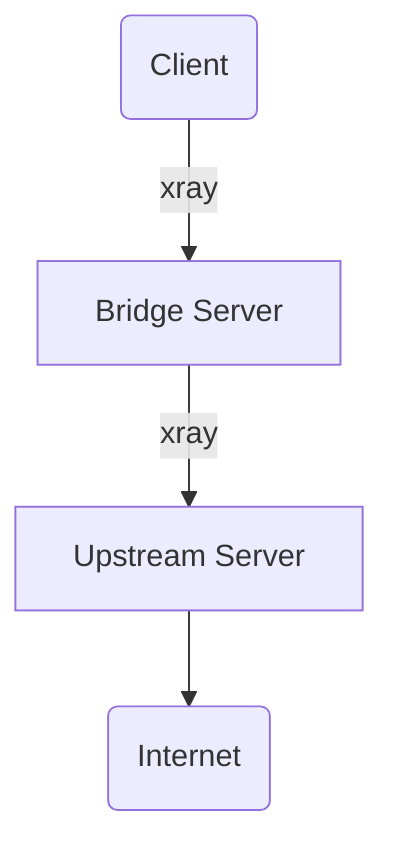

# xray-bridge-chain

Данный репозиторий предоставляет готовые конфигурации и вспомогательные скрипты для быстрой настройки **"Мостовой цепи" (Bridge Chain)** с использованием прокси-сервера **Xray**.


```mermaid
graph TD;
    A(Client) -->|xray| B[Bridge Server];
    B[Bridge Server] -->|xray| C[Upstream Server];
    C[Upstream Server] --> D(Internet);
```

Основная цель конфигурации — обеспечить эффективную маскировку прокси-трафика путем использования популярных российских веб-ресурсов в качестве внешних адресов (обфускации). Это позволяет скрыть факт использования VPN/прокси-сервиса, имитируя обычный HTTPS-трафик к легитимным доменам.

## Структура и компоненты

* `bridge/`: Конфигурационные файлы, предназначенные для установки и настройки **Bridge-сервера** (узел, принимающий трафик от клиента).
* `upstream/`: Конфигурационные файлы для **Upstream-сервера** (узел, который направляет трафик в Интернет).
* `generate-keys.sh`: Скрипт для автоматизации генерации необходимых ключей, сертификатов и ссылки для подключения.


## Запуск

1. Запустить скрипт `generate-keys.sh`, указать IP серверов, сохранить сгенерированные значения.
2. Вставить сохранённые значения в соответствующие места в конфигах bridge и upstream.
3. Скопировать `bridge/subscription/` на bridge-сервер (генерируется скриптом).
4. Зайти на bridge и upstream серверы и запустить сервисы `docker compose up -d`.
5. Добавить subscription URL `http://BRIDGE-IP:8080/sub` в клиент (v2rayN, v2rayNG, Hiddify и т.д.).

## Рекомендуемые домены для маскировки

### Для Bridge сервера (dest + serverNames):

- vk.ru - ВКонтакте
- www.vk.com - ВКонтакте
- m.vk.ru - ВКонтакте мобильный
- mail.ru - Mail.ru
- www.tinkoff.ru - Тинькофф
- www.ozon.ru - Озон
- www.wildberries.ru - Wildberries

### Для Upstream сервера:

- gosuslugi.ru - Госуслуги
- www.mos.ru - Мос.ру
- www.nalog.gov.ru - ФНС
- www.pfr.gov.ru - ПФР


### Важные замечания:

- Выбор домена для dest: Должен поддерживать TLS 1.3 и HTTP/2. Проверьте:

```bash
curl -I --tlsv1.3 --http2 https://vk.ru
```

- serverNames: Может содержать несколько доменов, клиент выбирает один случайно.
