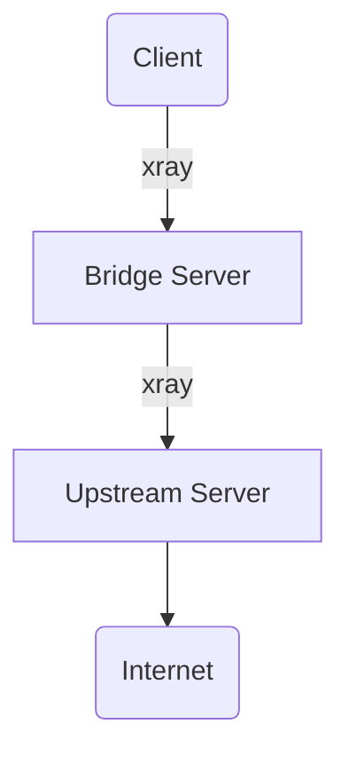
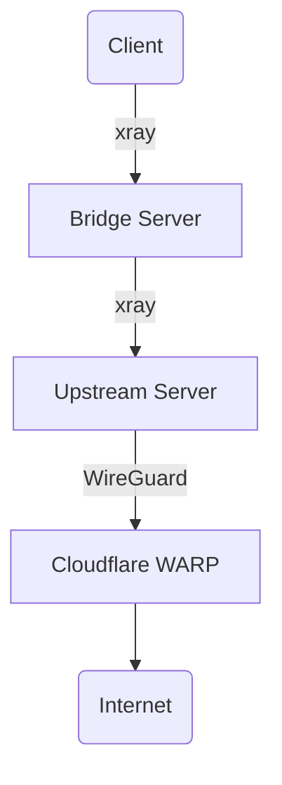

# xray-bridge-chain

Данный репозиторий предоставляет готовые конфигурации и вспомогательные скрипты для быстрой настройки **"Мостовой цепи" (Bridge Chain)** с использованием прокси-сервера **Xray**.


```mermaid
graph TD;
    A(Client) -->|xray| B[Bridge Server];
    B[Bridge Server] -->|xray| C[Upstream Server];
    C[Upstream Server] --> D(Internet);
```

Основная цель конфигурации — обеспечить эффективную маскировку прокси-трафика путем использования популярных российских веб-ресурсов в качестве внешних адресов (обфускации). Это позволяет скрыть факт использования VPN/прокси-сервиса, имитируя обычный HTTPS-трафик к легитимным доменам.

## Структура и компоненты

* `bridge/`: Конфигурационные файлы, предназначенные для установки и настройки **Bridge-сервера** (узел, принимающий трафик от клиента).
* `upstream/`: Конфигурационные файлы для **Upstream-сервера** (узел, который направляет трафик в Интернет через Cloudflare WARP).
* `generate-keys.sh`: Скрипт для автоматизации генерации необходимых ключей и сертификатов.


## Запуск

### Ручная настройка

1. Запустить скрипт `generate-keys.sh` — он сгенерирует ключи, подставит их в конфиги и выведет ссылки для подключения.
2. Зарегистрировать Cloudflare WARP и **вручную** подставить WireGuard-ключи в `upstream/config.json` (см. [Настройка WARP](#настройка-cloudflare-warp)).
3. Зайти на bridge и upstream серверы и запустить сервисы `docker compose up -d`.
4. Подключиться по сгенерированным на шаге 1 ссылкам.

### Автоматическая настройка через Ansible

Для автоматического развёртывания используется Ansible. Это устраняет необходимость ручной настройки серверов.

**Требования:**
- Установленный Ansible на локальной машине
- Доступ к серверам по SSH (пароль или SSH-ключ)

**Шаги настройки:**

1. Настройте инвентарь в `ansible/inventory/hosts.yml`:
```yaml
all:
  children:
    upstream:
      hosts:
        upstream-server:
          ansible_host: IP_ИЛИ_HOST_UPSTREAM
          ansible_user: root
    bridge:
      hosts:
        bridge-server:
          ansible_host: IP_ИЛИ_HOST_BRIDGE
          ansible_user: root
```

2. Запустите плейбук:
```bash
cd ansible
./setup.sh
```
Или напрямую:
```bash
# Для upstream-сервера
ansible-playbook -i inventory/hosts.yml upstream.yml

# Для bridge-сервера
ansible-playbook -i inventory/hosts.yml bridge.yml
```

Или используйте скрипт (запускает оба):
```bash
./setup.sh
```

3. В процессе выполнения будет запрошен SSH-пароль (если не настроены ключи).

4. После завершения в выводе появятся ссылки для подключения клиентов.

**Что делает плейбук автоматически:**
- Устанавливает Docker и Docker Compose на серверы
- Генерирует ключи Xray (UUID, пары ключей Reality, Short ID)
- Регистрирует WARP (WireGuard) для upstream-сервера
- Создаёт конфигурационные файлы из шаблонов
- Запускает контейнеры с Xray

**Переменные конфигурации:**

Настройки находятся в `ansible/group_vars/`:
- `all.yml` — общие настройки (образ Xray, порт)
- `upstream.yml` — настройки upstream-сервера (цель Reality, SNI, пути xhttp)
- `bridge.yml` — настройки bridge-сервера

**Важно: настройка bridge после upstream**

Bridge-сервер подключается к upstream, поэтому требует данных сгенерированных на upstream:

1. Сначала запустите upstream: `ansible-playbook -i inventory/hosts.yml upstream.yml`
2. В выводе найдите данные:
   - `UUID` (для upstream_uuid)
   - `Public Key` (для upstream_public_key)
   - `SID` (для upstream_short_id)
3. Заполните `ansible/group_vars/bridge.yml`:
```yaml
upstream_host: "IP_АДРЕС_UPSTREAM"
upstream_uuid: "df8480e6-..."  # UUID из вывода upstream
upstream_public_key: "QVUJdJ..."  # Public Key из вывода upstream
upstream_short_id: "d281889344e3f9e3"  # SID из вывода upstream
```
4. Запустите bridge: `ansible-playbook -i inventory/hosts.yml bridge.yml`

## Настройка Cloudflare WARP

Upstream-сервер направляет весь трафик через Cloudflare WARP (WireGuard), что скрывает реальный IP сервера за IP-адресами Cloudflare. Это позволяет обходить блокировки сервисов, которые блокируют IP-адреса VPS-провайдеров (ChatGPT, Netflix, Discord, Spotify и др.).


```mermaid
graph TD;
    A(Client) -->|xray| B[Bridge Server];
    B -->|xray| C[Upstream Server];
    C -->|WireGuard| D[Cloudflare WARP];
    D --> E(Internet);
```

### Получение ключей WARP

На upstream-сервере выполните:

```bash
# Скачать warp-reg
wget -O warp-reg https://github.com/badafans/warp-reg/releases/download/v1.0/main-linux-amd64
chmod +x warp-reg

# Зарегистрировать аккаунт и получить ключи
./warp-reg
```

Из вывода скопируйте значения в `upstream/config.json`:

| Поле в выводе warp-reg | Куда вставить в upstream/config.json |
|---|---|
| `private_key` | `WARP-PRIVATE-KEY` (поле `secretKey`) |
| `v6` | `WARP-IPV6-ADDRESS` (поле `address`, IPv6-адрес) |
| `reserved_dec` | `reserved` (массив из 3 чисел, например `[72, 114, 203]`) |

## Рекомендуемые домены для маскировки

### Для Bridge сервера (dest + serverNames):

- ya.ru - Яндекс (в соответствии с адресом VDS)

### Для Upstream сервера:

- vk.ru - ВКонтакте
- www.vk.com - ВКонтакте
- gosuslugi.ru - Госуслуги
- www.mos.ru - Мос.ру
- www.nalog.gov.ru - ФНС
- www.pfr.gov.ru - ПФР


### Важные замечания:

- Выбор домена для dest: Должен поддерживать TLS 1.3 и HTTP/2. Проверьте:

```bash
curl -I --tlsv1.3 --http2 https://ya.ru
```

- serverNames: Может содержать несколько доменов, клиент выбирает один случайно.
