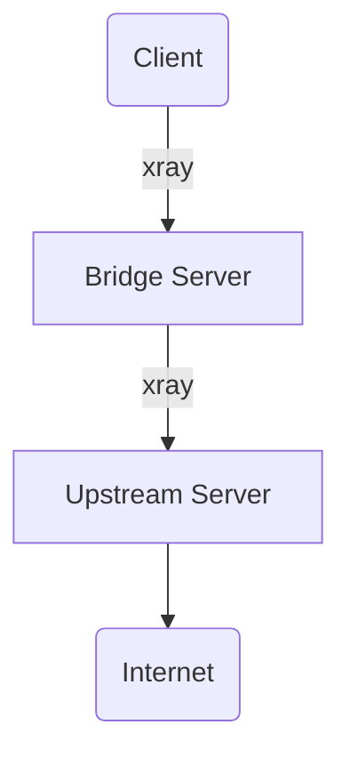
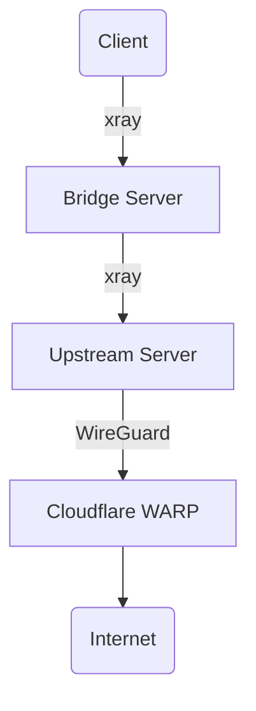

# xray-bridge-chain

Данный репозиторий предоставляет готовые конфигурации и вспомогательные скрипты для быстрой настройки **"Мостовой цепи" (Bridge Chain)** с использованием прокси-сервера **Xray**.


```mermaid
graph TD;
    A(Client) -->|xray| B[Bridge Server];
    B[Bridge Server] -->|xray| C[Upstream Server];
    C[Upstream Server] --> D(Internet);
```

Основная цель конфигурации — обеспечить эффективную маскировку прокси-трафика путем использования популярных российских веб-ресурсов в качестве внешних адресов (обфускации). Это позволяет скрыть факт использования VPN/прокси-сервиса, имитируя обычный HTTPS-трафик к легитимным доменам.

## Структура и компоненты

* `bridge/`: Конфигурационные файлы, предназначенные для установки и настройки **Bridge-сервера** (узел, принимающий трафик от клиента).
* `upstream/`: Конфигурационные файлы для **Upstream-сервера** (узел, который направляет трафик в Интернет через Cloudflare WARP).
* `generate-keys.sh`: Скрипт для автоматизации генерации необходимых ключей и сертификатов.


## Запуск

1. Запустить скрипт `generate-keys.sh` и сохранить сгенерированные значения и ссылки для подключения.
2. Зарегистрировать Cloudflare WARP и получить WireGuard-ключи (см. [Настройка WARP](#настройка-cloudflare-warp)).
3. Вставить сохранённые значения в соответствующие места в конфигах.
4. Зайти на bridge и upstream серверы и запустить сервисы `docker compose up -d`.
5. Подключиться по сгенерированным на шаге 1 ссылкам.

## Настройка Cloudflare WARP

Upstream-сервер направляет весь трафик через Cloudflare WARP (WireGuard), что скрывает реальный IP сервера за IP-адресами Cloudflare. Это позволяет обходить блокировки сервисов, которые блокируют IP-адреса VPS-провайдеров (ChatGPT, Netflix, Discord, Spotify и др.).


```mermaid
graph TD;
    A(Client) -->|xray| B[Bridge Server];
    B -->|xray| C[Upstream Server];
    C -->|WireGuard| D[Cloudflare WARP];
    D --> E(Internet);
```

### Получение ключей WARP

На upstream-сервере выполните:

```bash
# Скачать wgcf
wget -O wgcf https://github.com/ViRb3/wgcf/releases/download/v2.2.3/wgcf_2.2.3_linux_amd64
chmod +x wgcf

# Зарегистрировать аккаунт WARP
./wgcf register

# Сгенерировать профиль WireGuard
./wgcf generate
```

Из сгенерированного файла `wgcf-profile.conf` скопируйте значения:

| Поле в wgcf-profile.conf | Куда вставить в upstream/config.json |
|---|---|
| `PrivateKey` | `WARP-PRIVATE-KEY` |
| `Address` (IPv6) | `WARP-IPV6-ADDRESS` |

> **Примечание:** Поле `reserved` оставьте `[0, 0, 0]` для стандартной регистрации. Если используете WARP+ или warp-reg, подставьте значения из вывода утилиты.

## Рекомендуемые домены для маскировки

### Для Bridge сервера (dest + serverNames):

- vk.ru - ВКонтакте
- www.vk.com - ВКонтакте
- m.vk.ru - ВКонтакте мобильный
- mail.ru - Mail.ru
- www.tinkoff.ru - Тинькофф
- www.ozon.ru - Озон
- www.wildberries.ru - Wildberries

### Для Upstream сервера:

- gosuslugi.ru - Госуслуги
- www.mos.ru - Мос.ру
- www.nalog.gov.ru - ФНС
- www.pfr.gov.ru - ПФР


### Важные замечания:

- Выбор домена для dest: Должен поддерживать TLS 1.3 и HTTP/2. Проверьте:

```bash
curl -I --tlsv1.3 --http2 https://vk.ru
```

- serverNames: Может содержать несколько доменов, клиент выбирает один случайно.
